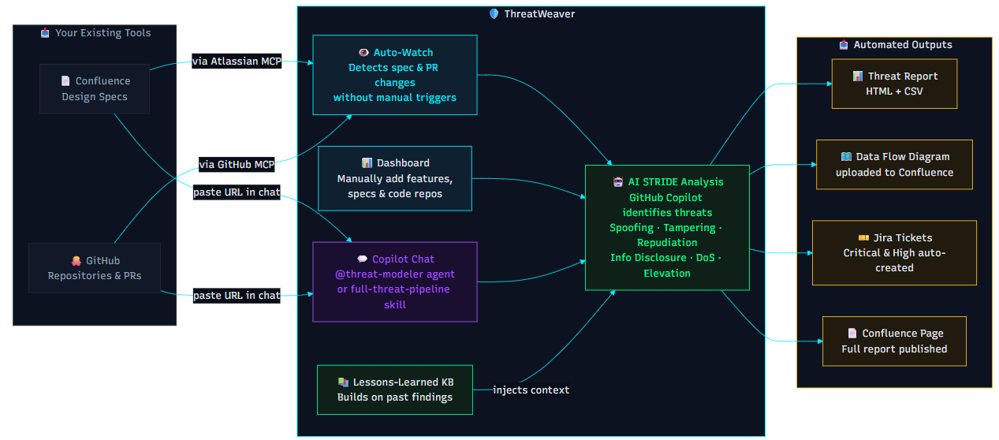

# ThreatWeaver — AI-Powered Threat Modeling (VS Code & Cursor IDE)

**Automated Threat Modeling/Security Analysis for Development Teams**

A powerful extension tool that brings automated threat modeling directly into your development environment. Works seamlessly with both **VS Code** and **Cursor IDE**. Analyze STRIDE based security threats from your Confluence based functional specs and code (PRs and diffs), generate comprehensive reports using Atlassian MCP - all without leaving your editor.


---

## 🎬 Demo

Download the full MP4 from the latest release:


https://github.com/Samiksha138/ThreatWeaver/releases/download/v0.0.1/ThreatWeaver_Walkthrough.mp4

---

## 📐 Architecture



> New here? Start with the **[Quick Start Guide](QUICKSTART.md)** for a step-by-step walkthrough.

---

## ✨ Key Features

- **AI-Powered Threat Analysis** — STRIDE-based security analysis via GitHub Copilot with dual-level assessment (code + design)
- **Multiple Confluence Pages** — Add multiple Confluence page URLs per feature for broader design coverage
- **Flexible Repository Analysis** — Three modes: PR diff, sub-directory, or whole-repo analysis
- **Interactive Dashboard** — Four-tab UI: Products, Threats, Reports, and Risk Score
- **Risk Score Dashboard** — Security posture score (0–100) with gauges, severity charts, and per-feature breakdowns
- **Publish to Confluence** — Write back threat results with design/code threat segregation and drawio DFD attachment
- **Jira Integration** — Auto-populate Jira tickets for Critical/High severity threats
- **HTML Reports** — Searchable, filterable reports with severity color-coding, status tracking, and persistent comments
- **PR Watcher** — Auto-detect new PRs and trigger security review
- **Confluence Watcher** — Auto-detect spec changes and trigger delta re-analysis with change summary
- **Scan Workspace** — Auto-import products/features created by `@threat-modeler` agent or `/full-threat-pipeline` skill into the dashboard
- **Knowledge Base** — Per-product lessons learned, auto-injected into analysis prompts for context-aware threat modeling
- **Validation Gate** — Pre-publish quality checks: STRIDE coverage, severity distribution, mitigation completeness, DFD alignment
- **Pipeline State Machine** — Resumable 9-phase pipeline (`pipeline-state.json`) for the `/full-threat-pipeline` skill
- **Copilot Customizations** — Slash commands, agents, skills, and auto-loaded instructions for STRIDE workflows
- **Auto-Update** — Self-hosted update via GitHub Releases
- **Cross-Platform** — Windows, macOS, Linux | VS Code and Cursor IDE

---

## 🚀 Installation & Prerequisites

### Requirements
- **VS Code** 1.85.0+ or **Cursor IDE**
- **GitHub Copilot** — Active subscription required

### Optional Tokens (configure as needed)

| Token | Purpose | Format |
|-------|---------|--------|
| Atlassian email + API token | **Required** for publishing to Confluence | Email + token from [Atlassian API Tokens](https://id.atlassian.com/manage-profile/security/api-tokens) |
| Bitbucket token | Repository analysis via MCP (Bitbucket Cloud via Atlassian MCP) | `BBDC-...` |
| GitHub PAT | Repository analysis via MCP | `ghp_...` (scope: `repo` or `public_repo`) |
| Jira PAT + Base URL | Create Jira tickets on on-prem Jira | PAT + `https://jira.your-company.com` |

> **Note**: Atlassian email and API token are **required** to publish threat models to Confluence (including draw.io diagrams). Generate your token at [id.atlassian.com](https://id.atlassian.com/manage-profile/security/api-tokens).

### Install from VSIX
1. Download `threatweaver-latest.vsix` - [GitHub Releases](https://github.com/Samiksha138/ThreatWeaver/releases/download/v0.0.1/threatweaver-latest.vsix)
2. Open VS Code or Cursor IDE
3. Go to Extensions → ⋯ menu → **"Install from VSIX..."**
4. Select the downloaded file

---

## 🎯 Quick Start

### Step 1 — Configure Credentials

1. Click the **🛡️ Shield icon** in the sidebar
2. Click **"🔑 Configure Credentials"**
3. Choose an option:
   - **🔧 Configure All Credentials** — Bitbucket + GitHub + Jira
   - **🏷️ Atlassian / Confluence** — Email + API Token (**required for Confluence publish**)
   - **🔗 Bitbucket Setup** — Bitbucket token
   - **🐙 GitHub Setup** — GitHub PAT
   - **🎫 Jira Setup (On-Prem)** — Jira PAT + base URL

> **Confluence publish requires Atlassian credentials.** Set your Atlassian email and API token in Configure Credentials → Atlassian / Confluence before using "Publish to Confluence".

### Step 2 — Start MCP Servers

1. Click **"▶️ Start MCP Servers"** in the sidebar
2. Wait for: *"✅ MCP servers started and mcp.json updated!"*

### Step 3 — Open the Dashboard

- Click **"🛡️ Open Dashboard"** in the sidebar, OR
- Command Palette: `Ctrl+Shift+P` → *"Threat Modeling: Open Threat Modeling Dashboard"*

### Step 4 — Create a Product (or Scan Workspace)

**Option A — Manual:**
1. In the **Products** tab, click **"+ Add Product"**
2. Enter product name (e.g., "MyApp")
3. Select the workspace folder

**Option B — Import from Agent:**
If you already used `@threat-modeler` or `/full-threat-pipeline` to create threat analysis files:
1. Click **"⟳ Scan Workspace"** in the Products tab
2. The extension discovers `{Product}/{Feature}/{Version}/design|repo/threat-analysis.md` folders
3. Matching products and features are automatically imported into the dashboard

### Step 5 — Add a Feature

1. Click **"+ Add Feature"** under your product
2. Fill in the form:
   - **Feature Name** — e.g., "Authentication Module"
   - **Version** — e.g., "1.0"
   - **Confluence URL(s)** — One or more page URLs (click "+ Add" for multiple)
   - **Repository URL** — Bitbucket or GitHub URL
   - **Repo Analysis Mode** — PR | Sub-directory | Whole Repo
   - **Confluence Writeback URL** — (Optional) Page to publish results back to
3. Click **"Add Feature"**

> At least one URL (Confluence or Repository) is required.

### Step 6 — Analyze Threats

1. Go to the **Threats** tab
2. Click **"Analyze Threats"** for your feature
3. Copilot Chat opens automatically with the analysis prompt
4. AI analyzes based on what you provided:
   - **Repository URL** → code-level vulnerabilities (saved to `repo/threat-analysis.md`)
   - **Confluence URL** → design-level architecture threats (saved to `design/threat-analysis.md`)
   - **Both** → comprehensive analysis

### Step 7 — Generate Report

1. Go to the **Reports** tab
2. Click **"Generate Report"** for your feature
3. Interactive HTML report opens with:
   - Statistics dashboard (Critical/High/Medium/Low counts)
   - Searchable and filterable threat table
   - Status tracking (Open → Triaged → Mitigated → Remediated / FP / Won't Fix)
   - Persistent comments per threat
   - Separate sections for Repository and Design-level threats

### Step 8 — Publish to Confluence

- Click **"Publish to Confluence"** to write threat results to the configured writeback page
- Design-level and code-level threats appear under separate headings
- Drawio DFD files are attached automatically

### Step 9 — Create Jira Tickets (Optional)

- Click **"Create Jira Issues"** to auto-populate tickets for Critical/High threats
- Each threat → Jira issue with title, description, severity, and STRIDE category

### Step 10 — Enable Watchers (Optional)

See [Automated Watchers](#-automated-watchers-pr--confluence) below.

### Step 11 — Stop MCP Servers

- Click **"⏹️ Stop MCP Servers"** in the sidebar when done

---

## 🖥️ Dashboard Tabs

| Tab | Purpose |
|-----|---------|
| 📦 **Products** | Manage products and features — add/edit URLs, versions, folder structure |
| ⚠️ **Threats** | Run threat analysis, create Jira issues, publish to Confluence, toggle PR/Doc watchers |
| 📊 **Reports** | Generate HTML reports, publish to Confluence |
| 📈 **Risk Score** | Security posture dashboard with score gauge, severity breakdown, per-feature metrics |

### Commands

**Sidebar** (🛡️ Shield icon):
- 🔑 Configure Credentials | ▶️ Start MCP Servers | 🛡️ Open Dashboard | ⏹️ Stop MCP Servers

**Command Palette** (`Ctrl+Shift+P`):
- `Threat Modeling: Open Threat Modeling Dashboard`
- `Threat Modeling: Scan Workspace for Threat Analysis`
- `Threat Modeling: Configure MCP Credentials`
- `Threat Modeling: Start MCP Servers`
- `Threat Modeling: Stop MCP Servers`

---

## 🤖 Copilot Customizations - VSCode

The extension auto-installs Copilot customization files into your workspace and user profile.

### Prompts (Slash Commands)

Type `/` in Copilot Chat:

| Command | When to Use |
|---------|-------------|
| `/threat-analyze` | New feature — provide Confluence/repo URLs for a full STRIDE analysis |
| `/delta-reanalyze` | Spec changed — reads existing threats + DFD and analyzes only what's different |
| `/pr-security-review` | PR ready — reviews only the changed lines |

### Agent (@threat-modeler)

Select in Copilot Chat agent picker. A persistent security architect persona for extended conversations — knows STRIDE methodology, output locations, and analysis modes.

### Skill (/full-threat-pipeline)

Type `/full-threat-pipeline` in Copilot Chat. Runs the entire pipeline end-to-end:
Gather inputs → Fetch content → STRIDE analysis → Generate DFDs → Validate format → Save files → Publish to Confluence → Create Jira tickets

## 🤖 Copilot Customizations - Cursor

**Cursor IDE:** Use `@threat-modeler.md/full-threat-pipeline` command — attach the agent file and type `/full-threat-pipeline` to run the complete pipeline.

> **Tip:** After using the agent or skill, click **"⟳ Scan Workspace"** in the Products tab to import the results into the dashboard.

### Instructions (Auto-Loaded)

| Instruction | Activates When | What It Does |
|-------------|---------------|---------------|
| `stride-format` | Editing `**/threat-analysis.md` | Forces exact STRIDE output format for report parser compatibility |
| `extension-dev` | Editing `src/**/*.ts` | Injects extension architecture context (esbuild, secrets, MCP) |

### Quick Reference

| Scenario | Use |
|----------|-----|
| One-off threat analysis | `/threat-analyze` prompt |
| Spec changed, incremental update | `/delta-reanalyze` prompt |
| Review a specific PR | `/pr-security-review` prompt |
| Extended security conversation | `@threat-modeler` agent |
| Full end-to-end pipeline | `/full-threat-pipeline` skill |

---

## 📈 Risk Score Dashboard

The **Risk Score** tab provides a visual security posture overview:

- **Score (0–100)**: `100 − (Critical×10 + High×5 + Medium×2 + Low×1)`, clamped to 0–100
- **Score Gauge**: Color-coded dial (green → red)
- **Severity Stacked Bar**: Visual breakdown across all features
- **Per-Feature Breakdown**: Individual scores and severity counts
- **Labels**: Excellent (90+) | Good (70–89) | Fair (50–69) | Poor (30–49) | Critical (<30)

Data sourced from `threat-analysis.md` files — refreshes automatically when the tab is opened.

---

## 📊 Report Features

### Interactive HTML Report
- Statistics dashboard with severity counts
- Searchable and filterable threat table
- Sortable columns
- Status tracking: Open / Triaged / Mitigated / Remediated / FP / Won't Fix
- Persistent comments per threat
- Separate Repository and Design-level threat sections
- Print to PDF (`Ctrl+P`)
- Shareable HTML file with embedded data

### Severity Color Coding
🔴 Critical | 🟠 High | 🟡 Medium | 🟢 Low

---

## 🔄 Automated Watchers (PR & Confluence)

### PR Watcher
1. Toggle **"🔀 PR Watch"** checkbox on a feature in the Threats tab
2. Watcher polls every 5 min (configurable via `aiThreatModeling.prWatchInterval`)
3. New/updated PR detected → Copilot Chat opens with PR threat analysis prompt
4. Notification confirms analysis has started

### Confluence Watcher
1. Toggle **"📄 Doc Watch"** checkbox on a feature in the Threats tab
2. Watcher polls at configured interval (default: 1 min, via `aiThreatModeling.confluenceWatchInterval`)
3. Page version change detected → reads existing threats + DFD → builds delta prompt → opens Copilot Chat
4. Output includes a **Change Summary** with new/removed/modified/unchanged threat counts

---

## ⚙️ Extension Settings

| Setting | Default | Description |
|---------|---------|-------------|
| `aiThreatModeling.mcpConfigPath` | *(auto-detect)* | Custom path to `mcp.json` file |
| `aiThreatModeling.prWatchInterval` | `5` min | PR polling interval (1–60 min) |
| `aiThreatModeling.confluenceWatchInterval` | `1` min | Confluence polling interval (1–60 min) |
| `aiThreatModeling.autoUpdateEnabled` | `true` | Check GitHub Releases for updates on startup |
| `aiThreatModeling.autoUpdateIntervalHours` | `6` hrs | Update check frequency (1–168 hrs) |
| `aiThreatModeling.githubRepo` | `Samiksha138/ThreatWeaver` | GitHub `owner/repo` for release updates |

---

## 🔧 MCP Server Configuration (Reference)

The extension auto-configures MCP servers. This section is for reference or manual setup.

### mcp.json Location

| IDE | Windows | macOS | Linux |
|-----|---------|-------|-------|
| VS Code | `%APPDATA%\Code\User\mcp.json` | `~/Library/Application Support/Code/User/mcp.json` | `~/.config/Code/User/mcp.json` |
| Cursor | `~\.cursor\mcp.json` | `~/.cursor/mcp.json` | `~/.cursor/mcp.json` |

*Auto-detected based on your IDE.*

### Manual Configuration (Advanced)

**Windows:**
```json
{
    "inputs": [],
    "servers": {
        "atlassian": {
            "type": "stdio",
            "command": "npx",
            "args": ["-y", "mcp-remote@latest", "https://mcp.atlassian.com/v1/mcp"]
        }
    }
}
```

**macOS/Linux:**
```json
{
    "inputs": [],
    "servers": {
        "atlassian": {
            "type": "stdio",
            "command": "/bin/sh",
            "args": ["-c", "npx -y mcp-remote@latest https://mcp.atlassian.com/v1/mcp"]
        }
    }
}
```
---

## 🔒 Security

- **Credential Storage** — All tokens encrypted via VS Code SecretStorage API
- **No Hardcoded Tokens** — Credentials never in code or config files
- **Data Privacy** — Reports stored locally; data only sent to Confluence/Bitbucket/GitHub via MCP over HTTPS
- **Permissions Required**:
  - Confluence: Read + write (for publish-back)
  - Bitbucket: Read access
  - GitHub: `repo` or `public_repo` scope
  - Jira: Create issue permission

---

## 📁 Folder Structure

```
WorkspaceRoot/
└── ProductName/
    ├── knowledge/                         ← lessons learned (product-level)
    │   ├── LESSON-001.md
    │   └── LESSON-002.md
    └── FeatureName/
        └── v1.0/
            ├── product-info.json
            ├── feature-info.json
            ├── pipeline-state.json          ← resumable pipeline state
            ├── jira-tickets.json            ← deduplication for Jira issues
            ├── repo/                        ← only if repository URL provided
            │   ├── threat-analysis.md
            │   ├── dataflow-diagram.md
            │   └── dataflow-diagram.drawio
            ├── design/                      ← only if Confluence URL provided
            │   ├── threat-analysis.md
            │   ├── dataflow-diagram.md
            │   └── dataflow-diagram.drawio
            └── threat-report-combined-[timestamp].html
```

---

## 🛠️ Troubleshooting

#### "MCP credentials not configured"
Credentials not set up. Click sidebar 🛡️ → "🔑 Configure Credentials" → enter tokens → "▶️ Start MCP Servers".

#### "Atlassian credentials are required to publish to Confluence"
Publishing to Confluence requires Atlassian email and API token. Click sidebar 🛡️ → "🔑 Configure Credentials" → fill in **Atlassian / Confluence** section → Save. Generate your API token at [id.atlassian.com](https://id.atlassian.com/manage-profile/security/api-tokens).

#### "No workspace folder selected"
Open a folder first: `File → Open Folder`.

#### "GitHub Copilot not available"
Install GitHub Copilot extension, sign in with active subscription, restart IDE.

#### "Failed to fetch Confluence page"
1. Verify URL format (full URL or page ID)
2. Check MCP servers are running
3. View "MCP Confluence Server" output channel

#### "Failed to fetch repository"
1. Verify URL: Bitbucket (`https://bitbucket.company.com/projects/PROJ/repos/repo`) or GitHub (`https://github.com/owner/repo`)
2. Check MCP servers are running
3. View "MCP Repository Analysis" output channel

#### "At least one URL must be provided"
Provide at least one Confluence URL or Repository URL when adding a feature.

#### macOS: "spawn npx ENOENT"
Node.js/npx not in PATH. Install via `brew install node`, verify with `which npx`, add to `~/.zshrc` if needed: `export PATH="/opt/homebrew/bin:$PATH"`. Restart IDE.

### Debug Mode

1. Open Output panel (`View → Output` or `Ctrl+Shift+U`)
2. Select: **"MCP Confluence Server"** or **"MCP Repository Analysis"**

---

## � Knowledge Base

Each product maintains a `{ProductName}/knowledge/` folder with lessons learned from past analyses. The `@threat-modeler` agent and `/full-threat-pipeline` skill automatically create lesson files after each analysis.

### How It Works
- Lessons are stored as `LESSON-001.md`, `LESSON-002.md`, etc.
- Each lesson has YAML frontmatter: `title`, `domain`, `tags`, `product`, `feature`, `createdAt`
- Domains: `authentication`, `authorization`, `data-flow`, `networking`, `cryptography`, `input-validation`, `other`
- Relevant lessons are auto-injected into subsequent analysis prompts for context-aware threat modeling
- Command: `Threat Modeling: Add Lesson to Knowledge Base` (programmatic — used by agents/skills)

### Lesson File Format
```markdown
---
title: "CHAP secrets exposed via REST endpoint"
domain: "cryptography"
tags: [Tri, iSCSI, CHAP]
product: "Tri"
feature: "SDL"
createdAt: 2026-05-06
---
The GetCHAP REST endpoint returns iSCSI CHAP secrets to any caller on the
plain HTTP interface without authentication, enabling credential exfiltration.
```

---

## ✅ Validation Gate

Before publishing to Confluence or creating Jira tickets, the extension can validate the `threat-analysis.md` quality:

| Check | Type | What It Verifies |
|-------|------|------------------|
| STRIDE coverage | Error if <4, warning if <6 | All 6 STRIDE categories should be addressed |
| Severity distribution | Warning | Flags if >80% are Critical (possible hallucination) or all same severity |
| Mitigation presence | Error | Each threat should have actionable mitigations |
| Component references | Warning | Threats should reference specific components, not be generic |
| DFD alignment | Warning | Components in the analysis should appear in the data flow diagram |
| File length | Error | Analysis must be ≥100 characters (not empty/stub) |

- **Command:** `Threat Modeling: Validate Threat Analysis` (programmatic — used by agents/skills before publish)
- **Result:** Returns `passed: true/false` with detailed `errors[]` and `warnings[]`

---

## 🔄 Pipeline State Machine

The `/full-threat-pipeline` skill uses a 9-phase state machine persisted in `pipeline-state.json` within each feature folder. This enables **resumable execution** — if a phase fails or the session ends, the pipeline picks up where it left off.

### Phases

| # | Phase | Description |
|---|-------|-------------|
| 0 | **Preflight** | Validate inputs, create folder structure, write `feature-info.json` |
| 1 | **Fetch Spec** | Retrieve Confluence pages and/or repository content via MCP |
| 2 | **Threat Analysis** | STRIDE analysis by Copilot — produces `threat-analysis.md` |
| 3 | **Validate Analysis** | Run Validation Gate checks on the output |
| 4 | **Generate DFD** | Create `dataflow-diagram.drawio` with Threat Modeling shapes |
| 5 | **Generate Report** | Produce HTML report via the dashboard report generator |
| 6 | **Publish Confluence** | Write results back to the Confluence writeback page |
| 7 | **Create Jira Tickets** | Create Jira issues for Critical/High threats |
| 8 | **Wrapup** | Save lessons learned, finalize state |

### Phase Statuses
`not-started` → `in-progress` → `completed` | `skipped` | `failed`

### Resumability
- On re-run, the pipeline reads `pipeline-state.json` and jumps to the first incomplete phase
- Completed phases are not re-executed
- Failed phases can be retried

---

## �🛡️ Use Cases

| Role | How They Use It |
|------|----------------|
| **Security Engineers** | Automate threat modeling, generate consistent assessments, track remediation, share reports |
| **Development Teams** | Shift-left security, understand code change implications, maintain threat models alongside code |
| **Compliance & Audit** | Generate audit-ready reports, document analysis process, track resolution over time |

---

## 📋 Changelog

### v0.0.1 (Current)
- Initial public release as **ThreatWeaver**
- **Multiple Confluence Pages** — add multiple URLs per feature
- **Flexible Repo Analysis** — PR, sub-directory, or whole-repo modes
- **Risk Score Dashboard** — posture score (0–100), gauge, severity charts, per-feature breakdown
- **Publish to Confluence** — writeback with design/code threat segregation + drawio DFD attachment
- **Jira Integration** — auto-populate tickets for Critical/High threats
- **PR Watcher** — per-feature polling, auto-triggers analysis on new/updated PRs
- **Confluence Watcher** — per-feature polling, delta re-analysis with change summary
- **Scan Workspace** — auto-import products/features created by `@threat-modeler` agent into the dashboard
- **Knowledge Base** — per-product lessons learned, auto-injected into analysis prompts
- **Validation Gate** — pre-publish quality checks (STRIDE coverage, severity distribution, mitigations, DFD alignment)
- **Pipeline State Machine** — resumable 9-phase pipeline for `/full-threat-pipeline` skill
- **Copilot Customizations** — prompts, agent, skill, and auto-loaded instructions
- **Auto-Update** — self-hosted via GitHub Releases
- **UI Improvements** — tabbed dashboard, inline watchers, collapsible sections, severity colors

---

## 💬 Support

- **Issues**: [GitHub Issues](https://github.com/Samiksha138/ThreatWeaver/issues) or email samiksha138@gmail.com
- **Documentation**: Available in the repository

---

## 🙏 Acknowledgments

- **GitHub Copilot** for AI-powered analysis
- **MCP (Model Context Protocol)** for Confluence, Bitbucket, GitHub, and Jira integration
- **VS Code Extension API** and **SecretStorage API** for secure, cross-platform operation
- HTTP-based MCP architecture (no Docker required)

---
=======
# ThreatWeaver — AI Threat Modeling (VS Code & Cursor IDE)

**Automated Security Analysis for Development Teams**

A powerful extension that brings automated threat modeling directly into your development environment. Works seamlessly with both **VS Code** and **Cursor IDE**. Analyze security threats, generate comprehensive reports, and integrate with Atlassian Confluence — all without leaving your editor.


---

## ✨ Key Features

- **AI-Powered Threat Analysis** — STRIDE-based security analysis via GitHub Copilot with dual-level assessment (code + design)
- **Multiple Confluence Pages** — Add multiple Confluence page URLs per feature for broader design coverage
- **Flexible Repository Analysis** — Three modes: PR diff, sub-directory, or whole-repo analysis
- **Interactive Dashboard** — Four-tab UI: Products, Threats, Reports, and Risk Score
- **Risk Score Dashboard** — Security posture score (0–100) with gauges, severity charts, and per-feature breakdowns
- **Publish to Confluence** — Write back threat results with design/code threat segregation and drawio DFD attachment
- **Jira Integration** — Auto-populate Jira tickets for Critical/High severity threats
- **HTML Reports** — Searchable, filterable reports with severity color-coding, status tracking, and persistent comments
- **PR Watcher** — Auto-detect new PRs and trigger security review
- **Confluence Watcher** — Auto-detect spec changes and trigger delta re-analysis with change summary
- **Scan Workspace** — Auto-import products/features created by `@threat-modeler` agent or `/full-threat-pipeline` skill into the dashboard
- **Knowledge Base** — Per-product lessons learned, auto-injected into analysis prompts for context-aware threat modeling
- **Validation Gate** — Pre-publish quality checks: STRIDE coverage, severity distribution, mitigation completeness, DFD alignment
- **Pipeline State Machine** — Resumable 9-phase pipeline (`pipeline-state.json`) for the `/full-threat-pipeline` skill
- **Copilot Customizations** — Slash commands, agents, skills, and auto-loaded instructions for STRIDE workflows
- **Auto-Update** — Self-hosted update via GitHub Releases
- **Cross-Platform** — Windows, macOS, Linux | VS Code and Cursor IDE

---

## 🚀 Installation & Prerequisites

### Requirements
- **VS Code** 1.85.0+ or **Cursor IDE**
- **GitHub Copilot** — Active subscription required

### Optional Tokens (configure as needed)

| Token | Purpose | Format |
|-------|---------|--------|
| Atlassian email + API token | **Required** for publishing to Confluence | Email + token from [Atlassian API Tokens](https://id.atlassian.com/manage-profile/security/api-tokens) |
| Bitbucket token | Repository analysis via MCP (Bitbucket Cloud via Atlassian MCP) | `BBDC-...` |
| GitHub PAT | Repository analysis via MCP | `ghp_...` (scope: `repo` or `public_repo`) |
| Jira PAT + Base URL | Create Jira tickets on on-prem Jira | PAT + `https://jira.your-company.com` |

> **Note**: Atlassian email and API token are **required** to publish threat models to Confluence (including draw.io diagrams). Generate your token at [id.atlassian.com](https://id.atlassian.com/manage-profile/security/api-tokens).

### Install from VSIX
1. Download `threatweaver-latest.vsix`
2. Open VS Code or Cursor IDE
3. Go to Extensions → ⋯ menu → **"Install from VSIX..."**
4. Select the downloaded file

---

## 🎯 Quick Start

### Step 1 — Configure Credentials

1. Click the **🛡️ Shield icon** in the sidebar
2. Click **"🔑 Configure Credentials"**
3. Choose an option:
   - **🔧 Configure All Credentials** — Bitbucket + GitHub + Jira
   - **🏷️ Atlassian / Confluence** — Email + API Token (**required for Confluence publish**)
   - **🔗 Bitbucket Setup** — Bitbucket token
   - **🐙 GitHub Setup** — GitHub PAT
   - **🎫 Jira Setup (On-Prem)** — Jira PAT + base URL

> **Confluence publish requires Atlassian credentials.** Set your Atlassian email and API token in Configure Credentials → Atlassian / Confluence before using "Publish to Confluence".

### Step 2 — Start MCP Servers

1. Click **"▶️ Start MCP Servers"** in the sidebar
2. Wait for: *"✅ MCP servers started and mcp.json updated!"*

### Step 3 — Open the Dashboard

- Click **"🛡️ Open Dashboard"** in the sidebar, OR
- Command Palette: `Ctrl+Shift+P` → *"Threat Modeling: Open Threat Modeling Dashboard"*

### Step 4 — Create a Product (or Scan Workspace)

**Option A — Manual:**
1. In the **Products** tab, click **"+ Add Product"**
2. Enter product name (e.g., "MyApp")
3. Select the workspace folder

**Option B — Import from Agent:**
If you already used `@threat-modeler` or `/full-threat-pipeline` to create threat analysis files:
1. Click **"⟳ Scan Workspace"** in the Products tab
2. The extension discovers `{Product}/{Feature}/{Version}/design|repo/threat-analysis.md` folders
3. Matching products and features are automatically imported into the dashboard

### Step 5 — Add a Feature

1. Click **"+ Add Feature"** under your product
2. Fill in the form:
   - **Feature Name** — e.g., "Authentication Module"
   - **Version** — e.g., "1.0"
   - **Confluence URL(s)** — One or more page URLs (click "+ Add" for multiple)
   - **Repository URL** — Bitbucket or GitHub URL
   - **Repo Analysis Mode** — PR | Sub-directory | Whole Repo
   - **Confluence Writeback URL** — (Optional) Page to publish results back to
3. Click **"Add Feature"**

> At least one URL (Confluence or Repository) is required.

### Step 6 — Analyze Threats

1. Go to the **Threats** tab
2. Click **"Analyze Threats"** for your feature
3. Copilot Chat opens automatically with the analysis prompt
4. AI analyzes based on what you provided:
   - **Repository URL** → code-level vulnerabilities (saved to `repo/threat-analysis.md`)
   - **Confluence URL** → design-level architecture threats (saved to `design/threat-analysis.md`)
   - **Both** → comprehensive analysis

### Step 7 — Generate Report

1. Go to the **Reports** tab
2. Click **"Generate Report"** for your feature
3. Interactive HTML report opens with:
   - Statistics dashboard (Critical/High/Medium/Low counts)
   - Searchable and filterable threat table
   - Status tracking (Open → Triaged → Mitigated → Remediated / FP / Won't Fix)
   - Persistent comments per threat
   - Separate sections for Repository and Design-level threats

### Step 8 — Publish to Confluence

- Click **"Publish to Confluence"** to write threat results to the configured writeback page
- Design-level and code-level threats appear under separate headings
- Drawio DFD files are attached automatically

### Step 9 — Create Jira Tickets (Optional)

- Click **"Create Jira Issues"** to auto-populate tickets for Critical/High threats
- Each threat → Jira issue with title, description, severity, and STRIDE category

### Step 10 — Enable Watchers (Optional)

See [Automated Watchers](#-automated-watchers-pr--confluence) below.

### Step 11 — Stop MCP Servers

- Click **"⏹️ Stop MCP Servers"** in the sidebar when done

---

## 🖥️ Dashboard Tabs

| Tab | Purpose |
|-----|---------|
| 📦 **Products** | Manage products and features — add/edit URLs, versions, folder structure |
| ⚠️ **Threats** | Run threat analysis, create Jira issues, publish to Confluence, toggle PR/Doc watchers |
| 📊 **Reports** | Generate HTML reports, publish to Confluence |
| 📈 **Risk Score** | Security posture dashboard with score gauge, severity breakdown, per-feature metrics |

### Commands

**Sidebar** (🛡️ Shield icon):
- 🔑 Configure Credentials | ▶️ Start MCP Servers | 🛡️ Open Dashboard | ⏹️ Stop MCP Servers

**Command Palette** (`Ctrl+Shift+P`):
- `Threat Modeling: Open Threat Modeling Dashboard`
- `Threat Modeling: Scan Workspace for Threat Analysis`
- `Threat Modeling: Configure MCP Credentials`
- `Threat Modeling: Start MCP Servers`
- `Threat Modeling: Stop MCP Servers`

---

## 🤖 Copilot Customizations - VSCode

The extension auto-installs Copilot customization files into your workspace and user profile.

### Prompts (Slash Commands)

Type `/` in Copilot Chat:

| Command | When to Use |
|---------|-------------|
| `/threat-analyze` | New feature — provide Confluence/repo URLs for a full STRIDE analysis |
| `/delta-reanalyze` | Spec changed — reads existing threats + DFD and analyzes only what's different |
| `/pr-security-review` | PR ready — reviews only the changed lines |

### Agent (@threat-modeler)

Select in Copilot Chat agent picker. A persistent security architect persona for extended conversations — knows STRIDE methodology, output locations, and analysis modes.

### Skill (/full-threat-pipeline)

Type `/full-threat-pipeline` in Copilot Chat. Runs the entire pipeline end-to-end:
Gather inputs → Fetch content → STRIDE analysis → Generate DFDs → Validate format → Save files → Publish to Confluence → Create Jira tickets

## 🤖 Copilot Customizations - Cursor

**Cursor IDE:** Use `@threat-modeler.md/full-threat-pipeline` command — attach the agent file and type `/full-threat-pipeline` to run the complete pipeline.

> **Tip:** After using the agent or skill, click **"⟳ Scan Workspace"** in the Products tab to import the results into the dashboard.

### Instructions (Auto-Loaded)

| Instruction | Activates When | What It Does |
|-------------|---------------|---------------|
| `stride-format` | Editing `**/threat-analysis.md` | Forces exact STRIDE output format for report parser compatibility |
| `extension-dev` | Editing `src/**/*.ts` | Injects extension architecture context (esbuild, secrets, MCP) |

### Quick Reference

| Scenario | Use |
|----------|-----|
| One-off threat analysis | `/threat-analyze` prompt |
| Spec changed, incremental update | `/delta-reanalyze` prompt |
| Review a specific PR | `/pr-security-review` prompt |
| Extended security conversation | `@threat-modeler` agent |
| Full end-to-end pipeline | `/full-threat-pipeline` skill |

---

## 📈 Risk Score Dashboard

The **Risk Score** tab provides a visual security posture overview:

- **Score (0–100)**: `100 − (Critical×10 + High×5 + Medium×2 + Low×1)`, clamped to 0–100
- **Score Gauge**: Color-coded dial (green → red)
- **Severity Stacked Bar**: Visual breakdown across all features
- **Per-Feature Breakdown**: Individual scores and severity counts
- **Labels**: Excellent (90+) | Good (70–89) | Fair (50–69) | Poor (30–49) | Critical (<30)

Data sourced from `threat-analysis.md` files — refreshes automatically when the tab is opened.

---

## 📊 Report Features

### Interactive HTML Report
- Statistics dashboard with severity counts
- Searchable and filterable threat table
- Sortable columns
- Status tracking: Open / Triaged / Mitigated / Remediated / FP / Won't Fix
- Persistent comments per threat
- Separate Repository and Design-level threat sections
- Print to PDF (`Ctrl+P`)
- Shareable HTML file with embedded data

### Severity Color Coding
🔴 Critical | 🟠 High | 🟡 Medium | 🟢 Low

---

## 🔄 Automated Watchers (PR & Confluence)

### PR Watcher
1. Toggle **"🔀 PR Watch"** checkbox on a feature in the Threats tab
2. Watcher polls every 5 min (configurable via `aiThreatModeling.prWatchInterval`)
3. New/updated PR detected → Copilot Chat opens with PR threat analysis prompt
4. Notification confirms analysis has started

### Confluence Watcher
1. Toggle **"📄 Doc Watch"** checkbox on a feature in the Threats tab
2. Watcher polls at configured interval (default: 1 min, via `aiThreatModeling.confluenceWatchInterval`)
3. Page version change detected → reads existing threats + DFD → builds delta prompt → opens Copilot Chat
4. Output includes a **Change Summary** with new/removed/modified/unchanged threat counts

---

## ⚙️ Extension Settings

| Setting | Default | Description |
|---------|---------|-------------|
| `aiThreatModeling.mcpConfigPath` | *(auto-detect)* | Custom path to `mcp.json` file |
| `aiThreatModeling.prWatchInterval` | `5` min | PR polling interval (1–60 min) |
| `aiThreatModeling.confluenceWatchInterval` | `1` min | Confluence polling interval (1–60 min) |
| `aiThreatModeling.autoUpdateEnabled` | `true` | Check GitHub Releases for updates on startup |
| `aiThreatModeling.autoUpdateIntervalHours` | `6` hrs | Update check frequency (1–168 hrs) |
| `aiThreatModeling.githubRepo` | `CSC-Security-sandbox/AI-Threat-Modeling` | GitHub `owner/repo` for release updates |

---

## 🔧 MCP Server Configuration (Reference)

The extension auto-configures MCP servers. This section is for reference or manual setup.

### mcp.json Location

| IDE | Windows | macOS | Linux |
|-----|---------|-------|-------|
| VS Code | `%APPDATA%\Code\User\mcp.json` | `~/Library/Application Support/Code/User/mcp.json` | `~/.config/Code/User/mcp.json` |
| Cursor | `~\.cursor\mcp.json` | `~/.cursor/mcp.json` | `~/.cursor/mcp.json` |

*Auto-detected based on your IDE.*

### Manual Configuration (Advanced)

**Windows:**
```json
{
    "inputs": [],
    "servers": {
        "atlassian": {
            "type": "stdio",
            "command": "npx",
            "args": ["-y", "mcp-remote@latest", "https://mcp.atlassian.com/v1/mcp"]
        }
    }
}
```

**macOS/Linux:**
```json
{
    "inputs": [],
    "servers": {
        "atlassian": {
            "type": "stdio",
            "command": "/bin/sh",
            "args": ["-c", "npx -y mcp-remote@latest https://mcp.atlassian.com/v1/mcp"]
        }
    }
}
```
---

## 🔒 Security

- **Credential Storage** — All tokens encrypted via VS Code SecretStorage API
- **No Hardcoded Tokens** — Credentials never in code or config files
- **Data Privacy** — Reports stored locally; data only sent to Confluence/Bitbucket/GitHub via MCP over HTTPS
- **Permissions Required**:
  - Confluence: Read + write (for publish-back)
  - Bitbucket: Read access
  - GitHub: `repo` or `public_repo` scope
  - Jira: Create issue permission

---

## 📁 Folder Structure

```
WorkspaceRoot/
└── ProductName/
    ├── knowledge/                         ← lessons learned (product-level)
    │   ├── LESSON-001.md
    │   └── LESSON-002.md
    └── FeatureName/
        └── v1.0/
            ├── product-info.json
            ├── feature-info.json
            ├── pipeline-state.json          ← resumable pipeline state
            ├── jira-tickets.json            ← deduplication for Jira issues
            ├── repo/                        ← only if repository URL provided
            │   ├── threat-analysis.md
            │   ├── dataflow-diagram.md
            │   └── dataflow-diagram.drawio
            ├── design/                      ← only if Confluence URL provided
            │   ├── threat-analysis.md
            │   ├── dataflow-diagram.md
            │   └── dataflow-diagram.drawio
            └── threat-report-combined-[timestamp].html
```

---

## 🛠️ Troubleshooting

#### "MCP credentials not configured"
Credentials not set up. Click sidebar 🛡️ → "🔑 Configure Credentials" → enter tokens → "▶️ Start MCP Servers".

#### "Atlassian credentials are required to publish to Confluence"
Publishing to Confluence requires Atlassian email and API token. Click sidebar 🛡️ → "🔑 Configure Credentials" → fill in **Atlassian / Confluence** section → Save. Generate your API token at [id.atlassian.com](https://id.atlassian.com/manage-profile/security/api-tokens).

#### "No workspace folder selected"
Open a folder first: `File → Open Folder`.

#### "GitHub Copilot not available"
Install GitHub Copilot extension, sign in with active subscription, restart IDE.

#### "Failed to fetch Confluence page"
1. Verify URL format (full URL or page ID)
2. Check MCP servers are running
3. View "MCP Confluence Server" output channel

#### "Failed to fetch repository"
1. Verify URL: Bitbucket (`https://bitbucket.company.com/projects/PROJ/repos/repo`) or GitHub (`https://github.com/owner/repo`)
2. Check MCP servers are running
3. View "MCP Repository Analysis" output channel

#### "At least one URL must be provided"
Provide at least one Confluence URL or Repository URL when adding a feature.

#### macOS: "spawn npx ENOENT"
Node.js/npx not in PATH. Install via `brew install node`, verify with `which npx`, add to `~/.zshrc` if needed: `export PATH="/opt/homebrew/bin:$PATH"`. Restart IDE.

### Debug Mode

1. Open Output panel (`View → Output` or `Ctrl+Shift+U`)
2. Select: **"MCP Confluence Server"** or **"MCP Repository Analysis"**

---

## � Knowledge Base

Each product maintains a `{ProductName}/knowledge/` folder with lessons learned from past analyses. The `@threat-modeler` agent and `/full-threat-pipeline` skill automatically create lesson files after each analysis.

### How It Works
- Lessons are stored as `LESSON-001.md`, `LESSON-002.md`, etc.
- Each lesson has YAML frontmatter: `title`, `domain`, `tags`, `product`, `feature`, `createdAt`
- Domains: `authentication`, `authorization`, `data-flow`, `networking`, `cryptography`, `input-validation`, `other`
- Relevant lessons are auto-injected into subsequent analysis prompts for context-aware threat modeling
- Command: `Threat Modeling: Add Lesson to Knowledge Base` (programmatic — used by agents/skills)

### Lesson File Format
```markdown
---
title: "CHAP secrets exposed via REST endpoint"
domain: "cryptography"
tags: [Tri, iSCSI, CHAP]
product: "Tri"
feature: "SDL"
createdAt: 2026-05-06
---
The GetCHAP REST endpoint returns iSCSI CHAP secrets to any caller on the
plain HTTP interface without authentication, enabling credential exfiltration.
```

---

## ✅ Validation Gate

Before publishing to Confluence or creating Jira tickets, the extension can validate the `threat-analysis.md` quality:

| Check | Type | What It Verifies |
|-------|------|------------------|
| STRIDE coverage | Error if <4, warning if <6 | All 6 STRIDE categories should be addressed |
| Severity distribution | Warning | Flags if >80% are Critical (possible hallucination) or all same severity |
| Mitigation presence | Error | Each threat should have actionable mitigations |
| Component references | Warning | Threats should reference specific components, not be generic |
| DFD alignment | Warning | Components in the analysis should appear in the data flow diagram |
| File length | Error | Analysis must be ≥100 characters (not empty/stub) |

- **Command:** `Threat Modeling: Validate Threat Analysis` (programmatic — used by agents/skills before publish)
- **Result:** Returns `passed: true/false` with detailed `errors[]` and `warnings[]`

---

## 🔄 Pipeline State Machine

The `/full-threat-pipeline` skill uses a 9-phase state machine persisted in `pipeline-state.json` within each feature folder. This enables **resumable execution** — if a phase fails or the session ends, the pipeline picks up where it left off.

### Phases

| # | Phase | Description |
|---|-------|-------------|
| 0 | **Preflight** | Validate inputs, create folder structure, write `feature-info.json` |
| 1 | **Fetch Spec** | Retrieve Confluence pages and/or repository content via MCP |
| 2 | **Threat Analysis** | STRIDE analysis by Copilot — produces `threat-analysis.md` |
| 3 | **Validate Analysis** | Run Validation Gate checks on the output |
| 4 | **Generate DFD** | Create `dataflow-diagram.drawio` with Threat Modeling shapes |
| 5 | **Generate Report** | Produce HTML report via the dashboard report generator |
| 6 | **Publish Confluence** | Write results back to the Confluence writeback page |
| 7 | **Create Jira Tickets** | Create Jira issues for Critical/High threats |
| 8 | **Wrapup** | Save lessons learned, finalize state |

### Phase Statuses
`not-started` → `in-progress` → `completed` | `skipped` | `failed`

### Resumability
- On re-run, the pipeline reads `pipeline-state.json` and jumps to the first incomplete phase
- Completed phases are not re-executed
- Failed phases can be retried

---

## �🛡️ Use Cases

| Role | How They Use It |
|------|----------------|
| **Security Engineers** | Automate threat modeling, generate consistent assessments, track remediation, share reports |
| **Development Teams** | Shift-left security, understand code change implications, maintain threat models alongside code |
| **Compliance & Audit** | Generate audit-ready reports, document analysis process, track resolution over time |

---

## 📋 Changelog

### v0.0.1 (Current)
- Initial public release as **ThreatWeaver**
- **Multiple Confluence Pages** — add multiple URLs per feature
- **Flexible Repo Analysis** — PR, sub-directory, or whole-repo modes
- **Risk Score Dashboard** — posture score (0–100), gauge, severity charts, per-feature breakdown
- **Publish to Confluence** — writeback with design/code threat segregation + drawio DFD attachment
- **Jira Integration** — auto-populate tickets for Critical/High threats
- **PR Watcher** — per-feature polling, auto-triggers analysis on new/updated PRs
- **Confluence Watcher** — per-feature polling, delta re-analysis with change summary
- **Scan Workspace** — auto-import products/features created by `@threat-modeler` agent into the dashboard
- **Knowledge Base** — per-product lessons learned, auto-injected into analysis prompts
- **Validation Gate** — pre-publish quality checks (STRIDE coverage, severity distribution, mitigations, DFD alignment)
- **Pipeline State Machine** — resumable 9-phase pipeline for `/full-threat-pipeline` skill
- **Copilot Customizations** — prompts, agent, skill, and auto-loaded instructions
- **Auto-Update** — self-hosted via GitHub Releases
- **UI Improvements** — tabbed dashboard, inline watchers, collapsible sections, severity colors

---

## 💬 Support

- **Issues**: [GitHub Issues]( or email samiksha138@gmail.com
- **Documentation**: Available in the repository

---

## 🙏 Acknowledgments

- **GitHub Copilot** for AI-powered analysis
- **MCP (Model Context Protocol)** for Confluence, Bitbucket, GitHub, and Jira integration
- **VS Code Extension API** and **SecretStorage API** for secure, cross-platform operation
- HTTP-based MCP architecture (no Docker required)

---
>>>>>>> parent of ee123d1 (README file)
